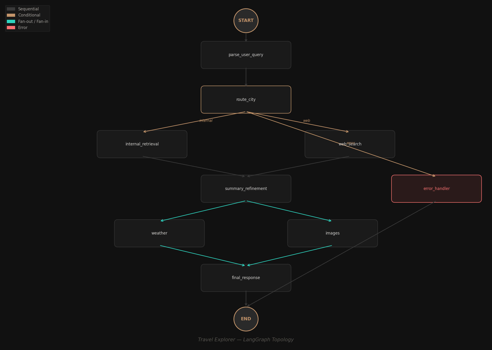

# 🌍 Multi-Modal Travel Assistant

A polished, agentic AI workflow that answers travel queries using **LangGraph** orchestration, **ChromaDB** vector retrieval, conditional routing, structured output, and a premium **Streamlit** interface.



---

## ✨ Overview

This project demonstrates a production-style multi-modal travel assistant built as an AI Engineering internship submission. It goes beyond a basic chatbot by implementing:

- **LangGraph StateGraph** with typed state, conditional routing, and parallel fan-out/fan-in
- **ChromaDB vector store** pre-populated with rich data for 3 cities (Paris, Tokyo, New York)
- **Mock web search fallback** for unknown cities
- **Manual tool execution layer** with a tool registry, input validation, and structured output
- **Structured Pydantic responses** — every query returns a `TravelResponse` object
- **Premium Streamlit UI** with glassmorphism, metric cards, Plotly charts, image gallery, and a debug panel

---

## 🏗️ Architecture

### Graph Flow

```
START
  │
  ▼
parse_user_query ─── extract city from natural language
  │
  ▼
route_city ─── check if city exists in vector store
  │
  ├─ internal ──▶ internal_retrieval (ChromaDB)
  │
  └─ web ──────▶ web_search (mock fallback)
  │
  ▼
summary_refinement ─── generate summary + recommendations
  │
  ├──▶ weather (fan-out, parallel)
  │
  └──▶ images  (fan-out, parallel)
  │
  ▼
final_response ─── assemble TravelResponse Pydantic object
  │
  ▼
END
```

### Routing Logic

1. User query is parsed → city name extracted using regex patterns + alias normalization
2. City is checked against the vector store's known set (`paris`, `tokyo`, `new york`)
3. If found → retrieve chunks from ChromaDB → high confidence (0.92)
4. If not found → mock web search generates realistic data → lower confidence (0.55–0.75)
5. Both paths converge at `summary_refinement`, then fan out to weather + image enrichment

### Parallel Fan-Out

LangGraph supports fan-out natively. `summary_refinement` has edges to both `weather` and `images` nodes. Both run in parallel and fan back into `final_response`. The `steps` field uses `Annotated[list, operator.add]` as a reducer to merge execution logs from parallel branches.

---

## 📦 Structured Output Schema

```python
class TravelResponse(BaseModel):
    city: str
    source_used: str             # "Internal Vector Store" or "Mock Web Search"
    city_summary: str
    weather_forecast: list[WeatherPoint]
    image_urls: list[str]
    recommendations: list[str]
    confidence_score: float      # 0.0–1.0
    generated_at: str            # ISO timestamp
```

---

## 🔧 Manual Tool Executor

Rather than relying on prebuilt `ToolNode`, this project implements a **manual tool execution layer**:

- **Tool Registry** — dictionary mapping tool names to their function, description, and input schema
- **`manual_tool_executor()`** — receives a `ToolInput`, validates the tool exists, calls the function with args, catches errors, and returns a structured `ToolOutput`
- Tools: `weather`, `images`, `web_search`

This demonstrates a clear understanding of how agent tool execution works under the hood.

---

## 🔍 Mock API Strategy

All external APIs are mocked for portability — no API keys required:

| Tool | Strategy |
|------|----------|
| **Weather** | Seeded `random.Random(hash(city))` generates deterministic 7-day forecasts |
| **Images** | Curated Unsplash URLs for known cities; parameterized URLs for others |
| **Web Search** | Template-based realistic results with city-specific seeding |

---

## 🧠 Memory & Checkpointer

- **Session-state memory**: Stores the last queried city in `st.session_state`. Follow-up queries like "Show me the forecast again" or "More images" reuse the previous city.
- **LangGraph MemorySaver**: A `MemorySaver` checkpointer is initialized and available for time-travel debugging and human-in-the-loop workflows. This enables replaying graph executions and inspecting intermediate states.

---

## 🎨 Standout UI Features

- **Wide layout** with dark gradient background
- **Glassmorphism cards** for content sections
- **Source badge** — purple for Vector Store, amber for Web Search
- **Execution timeline** showing each agent step with ✅/❌ status
- **Metric cards** — avg temp, warmest, coldest, image count
- **Interactive Plotly chart** — temperature line + humidity bars with dual y-axis
- **Image gallery** — 3-column responsive grid with hover animations
- **Debug panel** — expandable section showing detected city, route, state keys, and full JSON output
- **Example query buttons** for quick testing

---

## 📁 Folder Structure

```
travel_agent/
├── app.py                 # Streamlit entry point
├── requirements.txt       # Dependencies
├── README.md
├── .env.example
├── graph.png              # Auto-generated LangGraph topology
└── src/
    ├── __init__.py
    ├── config.py           # Constants and known cities
    ├── schemas.py          # Pydantic models
    ├── state.py            # LangGraph AgentState TypedDict
    ├── utils.py            # City normalization and extraction
    ├── vector_store.py     # ChromaDB setup and querying
    ├── tools.py            # Mock APIs + tool registry + executor
    ├── nodes.py            # All graph node functions
    ├── graph.py            # StateGraph construction + visualization
    ├── memory.py           # Session memory + MemorySaver
    └── ui_components.py    # Streamlit UI rendering
```

---

## 🚀 How to Run

```bash
# 1. Clone and navigate
cd travel_agent

# 2. Create virtual environment (recommended)
python -m venv venv && source venv/bin/activate

# 3. Install dependencies
pip install -r requirements.txt

# 4. Run the app
streamlit run app.py
```

No API keys needed — everything runs with mock data out of the box.

---


---

## ⚠️ Limitations

- All data is mocked — no real API calls to weather or search services
- Vector store uses ChromaDB's default embeddings (not a fine-tuned model)
- City extraction uses regex heuristics, not an LLM-based NER
- Image URLs depend on Unsplash availability

---

## 🔮 Future Improvements

- Integrate real APIs (OpenWeatherMap, Google Places, Unsplash API)
- Add LLM-powered query parsing (GPT/Claude/Gemini)
- Implement persistent vector store with user-uploaded city data
- Add conversation history with full LangGraph checkpointing
- Deploy on Streamlit Cloud with CI/CD
- Add unit tests for each node and tool

---

## ✅ Verification Checklist

- [x] LangGraph StateGraph used for orchestration
- [x] Streamlit UI with premium design
- [x] ChromaDB vector store with 3 cities (Paris, Tokyo, New York)
- [x] Conditional routing (internal vs. web)
- [x] Mock web search fallback for unknown cities
- [x] 7-day weather forecast with deterministic seeding
- [x] Image gallery with curated Unsplash URLs
- [x] Structured Pydantic output (`TravelResponse`)
- [x] `graph.png` auto-generated
- [x] Professional README
- [x] Memory/checkpointer (session state + MemorySaver)
- [x] Manual tool executor with registry pattern
- [x] Parallel fan-out for weather + image enrichment

